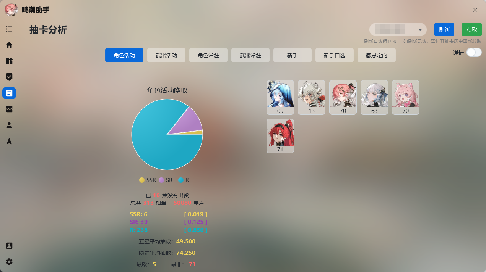

# 抽卡分析

> 当前助手的抽法分析UI缺乏设计，如果你对UI设计有所经验且有所意愿，可联系开发者。

鸣潮的抽卡只保存六个月的抽卡历史，且不具有直观有效的分析功能，助手提供了简单的抽卡数据的保存功能，即使超过六个月，也可以查看所有的历史记录。

通过抽卡分析，你可以做到：

* 获取并保存抽卡数据
* 分析抽卡记录

所有的抽卡记录均以JSON格式文本保存至  **助手安装目录/data目录**  按照游戏ID进行保存。

> 为了保证数据的安全性，自助手1.1.9版本起，每次获取新的抽卡历史，会自动将上一天的记录进行备份，如果数据出现错误，可以手动打开 **data目录** 对应ID目录，恢复备份的JSON文件。

