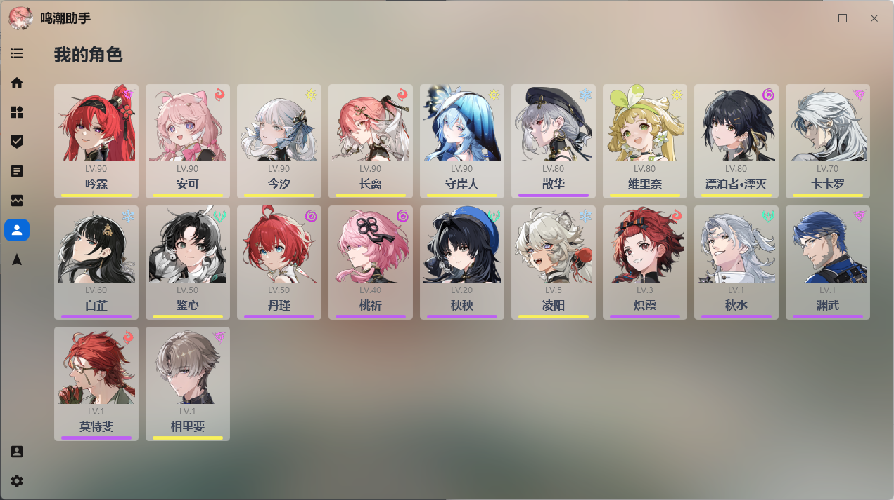
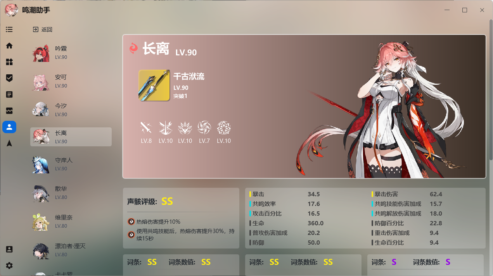

# 我的角色

!> 使用该功能需要添加库街区账号

通过我的角色，你可以做到：

* 查看游戏内拥有的所有角色信息
* 声骸测评

助手的声骸测评聚焦于声骸的养成，而不是pvp，故不会提供准确的分数。声骸测评聚焦于副词条，将从词条与词条数值两个角度对声骸进行分析，给使用者直观的数据以判断声骸是否可以毕业。

> 当前声骸测评可能不准确，你可以参考[声骸测评机制说明](phantom)，进行修改。

