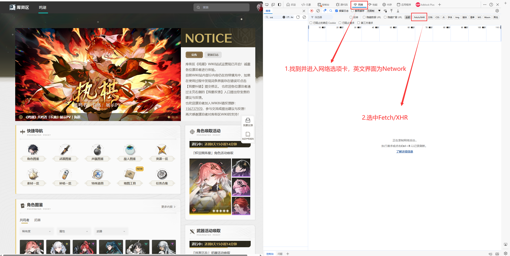
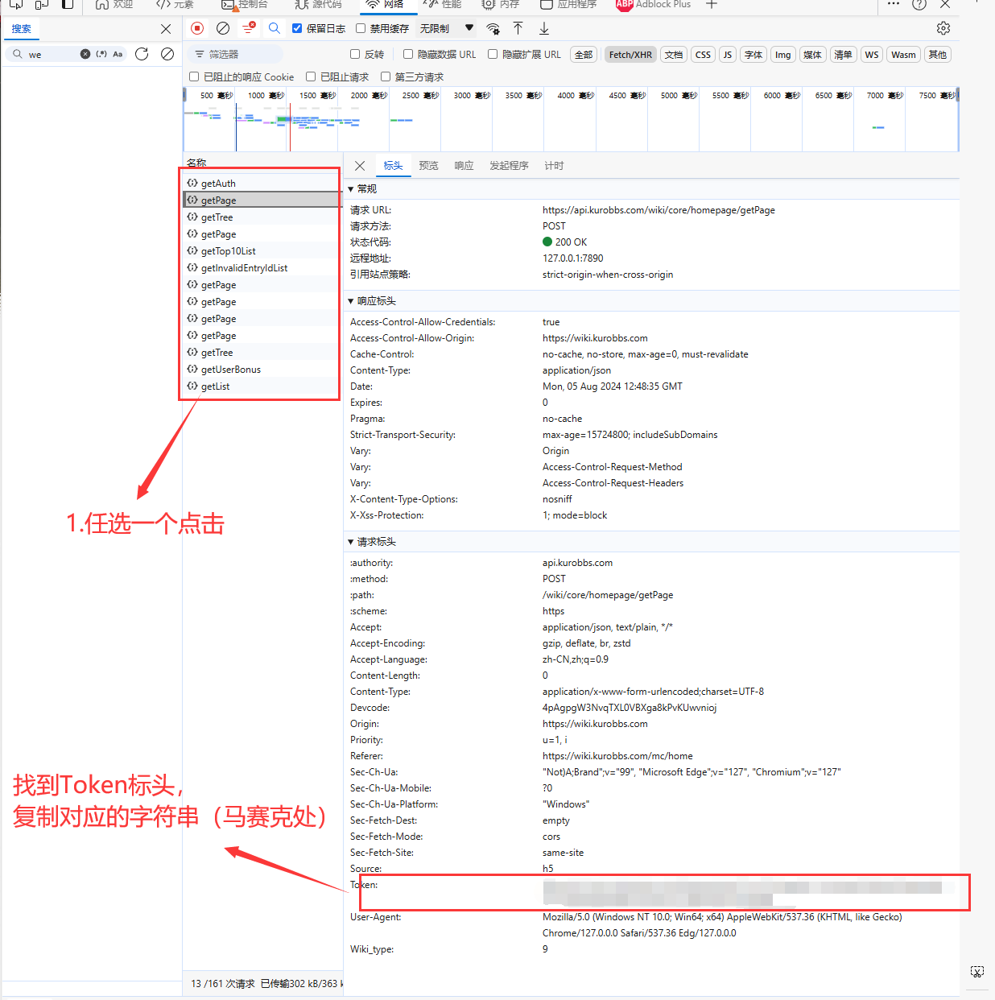
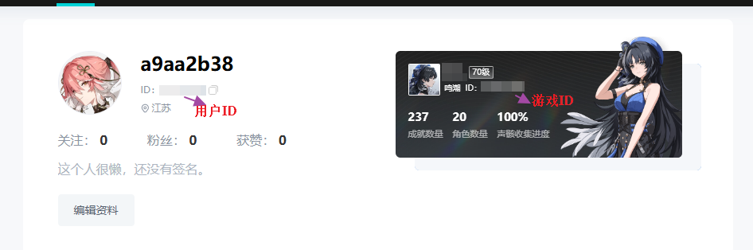

# 获取库街区用户Token

!> 本教程以Edge浏览器为例（其他浏览器操作几乎没区别），浏览器问题咨询搜索引擎，请勿打扰开发者

> 账号一旦登录，请勿退出，否则助手内库街区Token将失效；如果你需要添加多个账号，可以使用浏览器的隐私模式或者无痕模式进行多账号登录与添加

1. 登录

点击连接[库街区(https://wiki.kurobbs.com/mc/home)](https://wiki.kurobbs.com/mc/home)进入库街区鸣潮Wiki首页，点击右上角登录自己的库街区账号，登录后返回Wiki首页

2. 获取Token

点击键盘上的 F12 按键，调出浏览器的开发者模式，找到 网络 选项，点击进入，英文界面该选项卡名称为 Network。然后选中Fetch/XHR

点击键盘上的 F5 或者手动刷新网页，此时右侧会出现一堆请求连接，选择一个连接打开，这里以getPage为例，

然后找到标头Token，复制对应的字符串到助手中。

3. 注

如果你找不到库街区用户UID和鸣潮游戏ID(*特征码*)，点此连接查看[库街区信息](https://www.kurobbs.com/person-center)，请勿填写库街区用户名与游戏昵称

